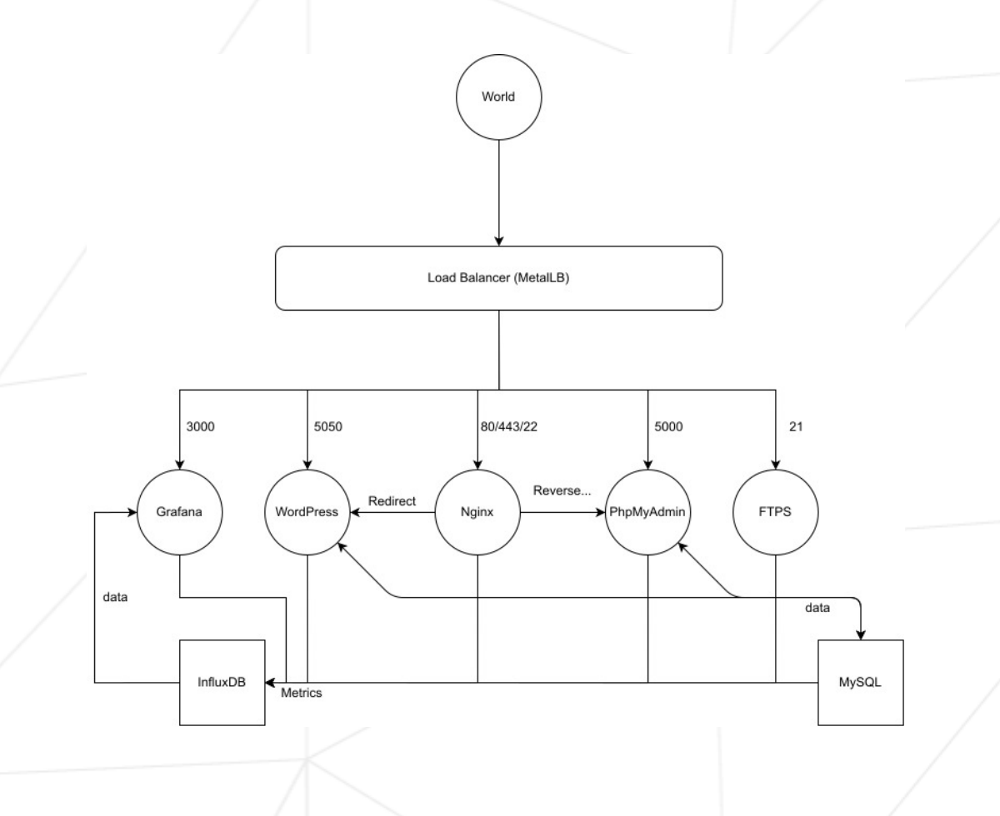
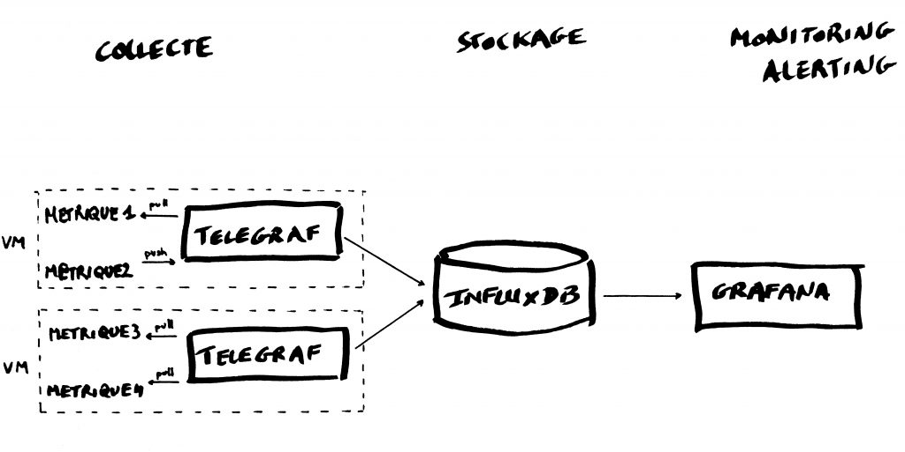

# ft_services

###Description
This project works on multiple Alpine Linux container.

###Diagram:

###Influxdb - Grafana - Telegraf

 - https://www.howtoforge.com/tutorial/how-to-install-tig-stack-telegraf-influxdb-and-grafana-on-ubuntu-1804/

        [source]

[source]: https://blog.octo.com/monitorer-votre-infra-avec-telegraf-influxdb-et-grafana/